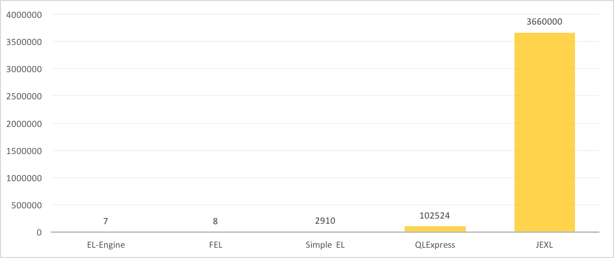
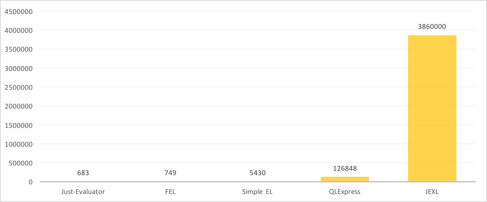
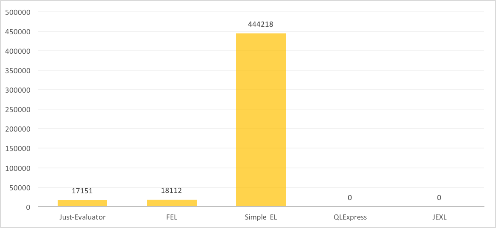

## Just-Evaluator

**JVM platform, high-performance, lightweight** expression evaluation engine, to provide interpretation and implementation of the implementation of a variety of evaluation methods.

### How to use？

* with gradle：

```groovy
	// Step 1. Add the JitPack repository to your build file
	allprojects {
		repositories {
			...
			maven { url 'https://jitpack.io' }
		}
	}
	// Step 2. Add the dependency
    dependencies {
		compile 'com.github.User:Repo:Tag'
	}
```

* with maven：

**Step 1.** Add the JitPack repository to your build file

``` xml
	<repositories>
		<repository>
		    <id>jitpack.io</id>
		    <url>https://jitpack.io</url>
		</repository>
	</repositories>
```

**Step 2.** Add the dependency

```xml
	<dependency>
	    <groupId>com.github.lfkdsk</groupId>
	    <artifactId>Just-Evaluator</artifactId>
	    <version>v1.0</version>
	</dependency>
```

### Usage

#### 1.Eval Simple Expr：

``` java
JustEL.runEval("i * pi + (d * b - 199) / (1 - d * pi) - (2 + 100 - i / pi) % 99 ==i * pi +(d * b - 199) / (1 - d * pi) - (2 + 100 - i / pi) % 99", 
        new JustMapContext() {{
            put("i", 100);
            put("pi", 3.14d);
            put("d", -3.9);
            put("b", (byte) 4);
            put("bool", false);
        }};
```

Then you can get the result from the return value.

#### 2.Eval Simple Expr With Expression:

``` java
Expression expr = 
JustEL.runEval("i * pi + (d * b - 199) / (1 - d * pi) - (2 + 100 - i / pi) % 99 ==i * pi + (d * b - 199) / (1 - d * pi) - (2 + 100 - i / pi) % 99");
expr.eval(new JustMapContext() {{
            put("i", 100);
            put("pi", 3.14d);
            put("d", -3.9);
            put("b", (byte) 4);
            put("bool", false);
        });               
```

In this way, you can build **AST of this expr** at once time, then eval by multi-contexts **many-times**. 

#### 3. Compile Expr to Expression 

``` java
Expression expr = 
  JustEL.runCompile("i * pi + (d * b - 199) / (1 - d * pi) - (2 + 100 - i / pi) % 99 ==i * pi +(d * b - 199) / (1 - d * pi) - (2 + 100 - i / pi) % 99", context);
expr.eval(context);
```

Your Expr String will be compile at **Runtime**, so you can calculate the result of the expr by **Java**. This way  has better permance when you will evaluate the result **million times, or even hundreds of millions of times** with same or different context.

### High-Level Usage

#### 4.Build The Components of  Evaluator By yourself 

``` java
                JustEL.builder()
                        .lexer(new JustLexerImpl())
                        .parser(new JustParserImpl())
                        .compiler(new JustCompilerImpl())
                        .generator(new JavaCodeGenerator())
                        .create()
                        .compile("1111 + lfkdsk + sss", context)
                        .eval(context)
```

You can change all **primary components**  of the Evaluator , contains *lexer* ,  *parser*,  *compiler*,  *template generator* .

#### 5. Extend Function

``` java
    public static class Add extends ExtendFunctionExpr {
        @Override
        public String funcName() {
            return "add";
        }

        @Override
        public Object call(Object... params) {
            Integer left = (Integer) params[0];
            Integer right = (Integer) params[1];

            if (left != null && right != null) {
                return left + right;
            }

            return this.call(params);
        }
    }
```

Create a new class **extend** ExtendFunctionExpr Class，Override funcName and call method，then you can put it into the context and use like this ：

``` java
JustContext context = new JustContext();
context.putExtendFunc("add", new ExtendFunctionExpr());
JustEL.runEval("add(111, 222.0)",context);
JustEL.runCompile("add(111, 222.0)",context);
```

#### 6. Add Binary Operator Support 

Just-Evaluator support **ast-level Binary-Operators** , Extent Operator will be supported as system-operators. 

``` java
    public static class NewOperator extends OperatorExpr {

        public NewOperator(List<AstNode> children) {
            super(children, 1000);
        }


        @Override
        public Object eval(JustContext env) {
            Object left = leftChild().eval(env);
            Object right = rightChild().eval(env);

            if (isNumber(left) && isNumber(right)) {
                return NumberUtils.computePlusValue(
                        (Number) NumberUtils.computePlusValue((Number) left, ((Number) right)),
                        (Number) right);
            }

            return super.eval(env);
        }

        @Override
        public String compile(JustContext env) {
            StringBuilder builder = new StringBuilder();
            String left = leftChild().compile(env);
            String right = rightChild().compile(env);
            builder.append("(")
                    .append(left)
                    .append("+")
                    .append(right)
                    .append("+")
                    .append(right)
                    .append(")");

            return builder.toString();
        }

        @Override
        public String funcName() {
            return "**";
        }
    }

```

Create new class **extend** OperatorsExpr Class and override eval or compile method according to your need. 

Then you have to set some *symbol support* :

``` java
// let lexer know ** is Operator-Symbol
lexer.insertSymbol("**");
// let parser know symbol, priority, combination and this class.
parser.insertOperators("**", 2, LEFT, NewOperator.class);
```

### Performance

Performance test compared to the other four mainstream expression calculation engine, the time is **100 million times** the pressure test of the contrast time, time unit **in milliseconds**.

#### 1.Pure Const Expr Test

Test usage :

``` java
1000+100.0*99-(600-3*15)%(((68-9)-3)*2-100)+10000%7*71
```



#### 2.Simple Expr Test

Test usage :

``` java
f+1000+100.0*99-(600-3*15)%(((68-9)-3)*2-100)+10000%7*71+f
```



#### 3.Complex Expr Test

Test usage:


Result：



QLExpress and JEXL's results cannot be drawn in the picture. QLExpress use 285000000 ms in the test, and JEXL use 27150000 ms in this test.

### Feature

- [x] Const Folding
- [x] ​Sub-AST Spliting
- [x] AstNode <==> Expression
- [ ] Balance AST Design
- [ ] ByteCode Support 

### Feedback    
Please send your feedback as long as there occurs any inconvenience or problem. You can contact me with:
* Email: lfk_dsk@hotmail.com  
* Weibo: [@亦狂亦侠_亦温文](http://www.weibo.com/u/2443510260)  
* Blog:  [刘丰恺](http://lfkdsk.github.io)  

### License

    Copyright 2017 [刘丰恺](http://lfkdsk.github.io/)

    Licensed under the Apache License, Version 2.0 (the "License");
    you may not use this file except in compliance with the License.
    You may obtain a copy of the License at
    
       http://www.apache.org/licenses/LICENSE-2.0
    
    Unless required by applicable law or agreed to in writing, software
    distributed under the License is distributed on an "AS IS" BASIS,
    WITHOUT WARRANTIES OR CONDITIONS OF ANY KIND, either express or implied.
    See the License for the specific language governing permissions and
    limitations under the License.
